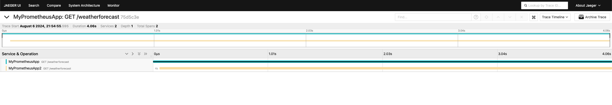

# Prometheus, Grafa & Jaeger

## Quick start

1. In the root directory, run `docker-compose up -d`. This will start
    * Grafana on `http://localhost:3000` with a username and password of admin
    * Prometheus on `http://localhost:9090`
    * Jaeger on `http://localhost:16686`
2. You view the prometheus configuration [here](./prometheus/prometheus.yml) and the grafana configuration [here](./grafana/provisioning/datasources/datasource.yml).
3. Under `example_app` there are two demo applications that are instrumented with tracing and metrics. Tracing is sent to `jaeger` and the metrics are scraped by `prometheus` which you can visualise in grafana.
4. Both applications are simple .NET 8 applications. Everything you need to find is in `Program.cs`. `MyPrometheusApp` is configured to call `MyPrometheusApp2` using a HTTP client. Because both of the applications are instrumented with OpenTelemetry, when the first app calls the second app, you can see the trace in jaeger. It looks something like this:
 (as you can see it first starts with `MyPrometheusApp` calling `MyPrometheusApp2`)
5. Theoretically you can have any demo application in any language as long as it supports OpenTelemetry. For example, you could have a chain of services. When you invoke one of them, it might look like `App1 -> App2 -> App3 -> App4`. As long as each of these apps are instrumented with OpenTelemetry and are exporting to jaeger, you will see the trace in the jaeger UI.
6. Both demo .NET applications map a `/metrics` endpoint. Prometheus scrapes this at intervals defined by the configuration. This data is then made available in grafana. You can visualise things like how many requests were made, how many were 200, how many were 400, etc etc.  